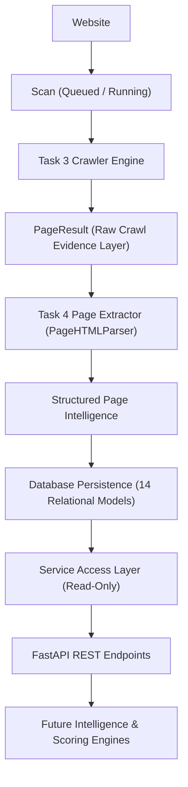

# Page Extraction Engine Specification

## 1. Purpose

The Page Extraction Engine is the core deterministic HTML analysis component of the Raval AI GEO/AEO/SEO Intelligence platform. It extracts structured, auditable, raw technical evidence from crawled web page content (`PageResult.content`) without re-fetching, external network requests, or speculative assumptions.

---

## 2. Scope

The Page Extraction layer is responsible for converting unstructured raw HTML documents stored in `PageResult` into structured, queryable relational entities across 14 database models covering 13 distinct technical SEO, GEO, and AEO evidence domains.

---

## 3. Task 3 Dependency & Crawl Isolation

- **Source of Truth**: The extraction engine strictly consumes the `PageResult.content`, `PageResult.content_type`, and `PageResult.url`/`final_url` already captured by the Task 3 crawler.
- **Zero Network I/O**: The extractor never performs HTTP requests, does not download images, does not follow hyperlinks, and does not query remote schema registries.
- **Decoupled Architecture**: Crawling and extraction are isolated phases. A crawler failure produces a crawl-level error state, while extraction errors are localized to page-level records without aborting the scan.

---

## 4. Extraction Architecture

The system enforces strict architectural boundaries:



---

## 5. PageResult → PageExtraction Flow

```text
PageResult (status_code, content_type, url, content)
    │
    ▼
extract_html(html_content, content_type, page_url)
    │  ├─ PageHTMLParser tokenization & tag parsing
    │  ├─ JSON-LD recursive parsing & traversal
    │  ├─ Microdata extraction
    │  ├─ Semantic & Schema.org breadcrumbs
    │  ├─ Image attributes & dimensions
    │  ├─ Link extraction & internal/external classification
    │  ├─ Language & hreflang detection
    │  └─ Clean text & visible word count
    ▼
extract_page(db, page_result)
    │  ├─ Upsert PageExtraction scalar record
    │  ├─ Idempotent purge of existing child evidence
    │  ├─ Insert 12 child domain entity records
    │  └─ Synthesize & persist PageIndexabilityEvidence
    ▼
extract_scan_pages(db, scan_id)
    │  ├─ Iterate all scan pages
    │  ├─ Scan-scoped cross-page duplicate title analysis
    │  └─ Scan-scoped cross-page duplicate meta description analysis
```

---

## 6. Page & Scan Traceability

Every extracted record maintains full two-way traceability:
- Every `PageExtraction` has a foreign key to `page_results.id` (1:1) and `scans.id` (N:1).
- Every child evidence row (`PageHeading`, `PageImage`, etc.) links directly to `page_extractions.id`.
- Scan-level intelligence queries (`/api/v1/scans/{scan_id}/page-intelligence`) retrieve all extracted page evidence associated with that specific crawl execution.

---

## 7. Database Structure (14 Relational Models)

| Entity / Model | Database Table | Relationship to `PageExtraction` | Key Evidence Fields |
|---|---|---|---|
| **PageExtraction** | `page_extractions` | Parent Model (1:1 with `PageResult`) | `html_available`, `clean_text_available`, `word_count`, `title_*`, `h1_count`, `canonical_*`, `image_count`, `images_without_alt`, `extraction_status` |
| **PageMetaDescription** | `page_meta_descriptions` | 1 : N (One-to-Many) | `position`, `text`, `length`, `word_count`, `empty`, `duplicate_within_page`, `duplicate_in_scan`, `too_short`, `too_long` |
| **PageHeading** | `page_headings` | 1 : N (One-to-Many) | `level` (1–6), `text`, `position`, `empty` |
| **PageCanonical** | `page_canonicals` | 1 : N (One-to-Many) | `position`, `url`, `empty`, `valid`, `self_reference`, `cross_page` |
| **PageRobots** | `page_robots` | 1 : 1 (One-to-One) | `raw_content`, `index`, `follow`, `noindex`, `nofollow`, `noarchive`, `nosnippet`, `other_directives` |
| **PageSocialMetadata** | `page_social_metadata` | 1 : N (One-to-Many) | `platform` (`open_graph`/`twitter`), `property_name`, `content`, `position`, `empty`, `duplicate` |
| **PageStructuredData** | `page_structured_data` | 1 : N (One-to-Many) | `block_position`, `raw_block`, `parsed_json`, `context`, `types`, `entity_names`, `entity_urls`, `parse_error` |
| **PageMicrodata** | `page_microdata` | 1 : N (One-to-Many) | `item_position`, `item_type`, `item_id`, `properties`, `raw_snippet` |
| **PageBreadcrumb** | `page_breadcrumbs` | 1 : N (One-to-Many) | `position`, `detection_method` (`schema_org`/`semantic_html`), `name`, `url` |
| **PageImage** | `page_images` | 1 : N (One-to-Many) | `position`, `url`, `alt`, `alt_missing`, `alt_empty`, `width`, `height`, `file_type`, `loading`, `lazy_loaded` |
| **PageLink** | `page_links` | 1 : N (One-to-Many) | `position`, `source_url`, `destination_url`, `anchor_text`, `rel_raw`, `nofollow`, `sponsored`, `ugc`, `link_type` |
| **PageLanguage** | `page_languages` | 1 : 1 (One-to-One) | `html_lang`, `detected_language` |
| **PageHreflang** | `page_hreflang` | 1 : N (One-to-Many) | `position`, `language_region`, `target_url`, `duplicate_declaration`, `conflicting_declaration` |
| **PageIndexabilityEvidence** | `page_indexability_evidence` | 1 : 1 (One-to-One) | `http_status`, `robots_txt_allowed`, `page_noindex`, `page_nofollow`, `canonical_url`, `redirected`, `final_url`, `content_type`, `evidence_summary` |

---

## 8. Extraction Lifecycle

1. **Triggering**: Automatic post-crawl trigger inside `services.run_scan()`, or manual invocation via `extract_scan_pages()` / `extract_page()`.
2. **Parsing Phase**: Standard library `html.parser.HTMLParser` processes the HTML character stream in a single pass.
3. **Normalization Phase**: Whitespace normalization, HTML entity unescaping, relative URL resolution via `urllib.parse.urljoin`.
4. **Validation & Evidence Synthesis**: Cross-page comparison within the scan scope, heading hierarchy evaluation, canonical conflict analysis.
5. **Persistence Phase**: Atomic SQLAlchemy transaction persisting the extraction tree.
6. **State Transition**: `PageExtraction.extraction_status` transitions to `"success"`, `"skipped_non_html"`, `"failed_crawl"`, or `"error"`.

---

## 9. Basic Page Information

- `html_available`: True if document contains parsable HTML content.
- `clean_text_available`: True if visible clean text exists after removing non-content elements.
- `word_count`: Total word count computed from visible text tokens.
- `detected_language`: Primary language tag derived from the HTML document.

---

## 10. Title Extraction Rules

- Captures exact text between `<title>` and `</title>`.
- Auto-closes open `<title>` tags when subsequent block elements are encountered.
- **Evidence Fields**: `title_present`, `title_text`, `title_length`, `title_word_count`, `title_empty` (length == 0), `title_too_short` (<10 chars), `title_too_long` (>60 chars), `title_duplicate` (multiple `<title>` tags or identical title across scan).

---

## 11. Meta Description Extraction Rules

- Extracts all `<meta name="description" content="...">` tags.
- Preserves document position and original unescaped text.
- **Evidence Fields**: `position`, `text`, `length`, `word_count`, `empty`, `too_short` (<50 chars), `too_long` (>160 chars), `duplicate_within_page`, `duplicate_in_scan`.

---

## 12. H1–H6 Headings Extraction Rules

- Extracts all `<h1>` through `<h6>` headings preserving strict document order.
- **Hierarchy Detection**: Flags `missing_h1` (`h1_count == 0`), `multiple_h1` (`h1_count > 1`), and `heading_hierarchy_issue` (e.g. document starting with H2/H3 or jumping levels from H1 to H4).

---

## 13. Canonical Extraction Rules

- Extracts `<link rel="canonical" href="...">`.
- Resolves relative URLs against `page_url`.
- **Evidence Fields**: `position`, `url`, `valid` (valid HTTP/HTTPS scheme), `self_reference` (matches normalized page URL), `cross_page` (points to distinct page), `canonical_multiple` (>1 tag), `canonical_conflict` (divergent target URLs).

---

## 14. Page-Level Robots Directives

- Extracts `<meta name="robots" content="...">` and bot-specific meta tags (`googlebot`, `bingbot`).
- Parses directives into boolean flags: `index`, `follow`, `noindex`, `nofollow`, `noarchive`, `nosnippet`.
- Preserves unknown or specialized directives (e.g. `max-image-preview:large`) in `other_directives`.

---

## 15. Open Graph Metadata

- Extracts `property="og:*"` and `name="og:*"` meta tags.
- Supports `og:title`, `og:description`, `og:image`, `og:url`, `og:type`, `og:site_name`, etc.
- Records position, content, empty state, and flags duplicate properties.

---

## 16. Twitter / X Cards Metadata

- Extracts `name="twitter:*"` and `property="twitter:*"` tags.
- Supports `twitter:card`, `twitter:title`, `twitter:description`, `twitter:image`, `twitter:site`, `twitter:creator`.
- Flags empty values and duplicates.

---

## 17. JSON-LD / Schema.org Structured Data

- Extracts all `<script type="application/ld+json">` blocks preserving block position.
- Safely parses JSON structures (objects, arrays, nested schemas, `@graph` trees) with recursive traversal.
- Extracts `@context`, `@type` list, `entity_names`, `entity_urls`, and `@id`.
- Invalid JSON-LD captures the raw text and records `parse_error` without failing the parser.

---

## 18. Microdata Extraction

- Extracts HTML tags containing `itemscope`, `itemtype`, `itemid`, and `itemprop`.
- Stores `item_position`, `item_type`, `item_id`, `properties` dictionary, and `raw_snippet`.

---

## 19. Breadcrumbs Extraction

- **Schema.org**: Extracts ordered breadcrumbs from JSON-LD `BreadcrumbList` schemas (`detection_method="schema_org"`).
- **Semantic HTML**: Fallback extraction from `<nav aria-label="breadcrumb">` or `<ol class="breadcrumb">` (`detection_method="semantic_html"`).
- Distinguishes breadcrumbs from standard top-level navigation bars.

---

## 20. Images

- Extracts all `` tags: `position`, `url` (resolved relative URLs), `alt`, `width`, `height`, `file_type`, `loading`.
- Differentiates `alt_missing` (`alt` attribute absent) from `alt_empty` (`alt=""` present for decorative imagery).
- Flags `lazy_loaded` (`loading="lazy"`, `class="lazy"`, or `data-src`).
- Computes `image_count` and `images_without_alt`.

---

## 21. Links

- Extracts all `<a>` tags: `position`, `source_url`, `destination_url`, `anchor_text`, `rel_raw`.
- Resolves relative URLs.
- Classifies `link_type` (`internal` vs `external`) by comparing origin netloc.
- Parses rel flags: `nofollow`, `sponsored`, `ugc`.

---

## 22. Language

- Extracts `lang` or `xml:lang` from `<html>` into `PageLanguage.html_lang` and `PageExtraction.detected_language`.
- Missing language attributes remain `None` without guessing.

---

## 23. Hreflang Declarations

- Extracts `<link rel="alternate" hreflang="..." href="...">`.
- Flags `duplicate_declaration` (same target URL repeated) and `conflicting_declaration` (multiple distinct target URLs for same language).

---

## 24. Clean Content & Boilerplate Handling

- Removes non-visible elements (`<script>`, `<style>`, `<noscript>`, `<svg>`, `<canvas>`, `<template>`, `<head>`).
- Normalizes whitespace into `clean_text` and calculates `word_count`.

---

## 25. Indexability Evidence Synthesis

Aggregates technical signals into `PageIndexabilityEvidence`:
- `http_status`: From `PageResult.status_code`.
- `robots_txt_allowed`: Nullable (`None` until crawler exposes per-page robots authorization).
- `page_noindex` / `page_nofollow`: From extracted robots directives.
- `canonical_url`: Normalized URL of first valid canonical tag.
- `redirected`: True if `PageResult.final_url` differs from `PageResult.url`.
- `evidence_summary`: Complete JSON payload of raw contributing signals.

---

## 26. API & Service Access Layer

All API endpoints are read-only and return validated Pydantic models:

| HTTP Method | Route Path | Purpose / Response Model | 404 Error Detail |
|---|---|---|---|
| `GET` | `/api/v1/pages/{page_id}/intelligence` | Full page intelligence overview (`PageIntelligenceResponse`) | `"Page not found"` |
| `GET` | `/api/v1/pages/{page_id}/extraction` | Core extraction summary (`PageExtractionResponse`) | `"Page not found"` / `"Page extraction not found"` |
| `GET` | `/api/v1/pages/{page_id}/metadata` | Meta tags, canonicals, robots, social (`PageMetadataResponse`) | `"Page not found"` / `"Page extraction not found"` |
| `GET` | `/api/v1/pages/{page_id}/headings` | Ordered H1–H6 headings (`list[PageHeadingResponse]`) | `"Page not found"` / `"Page extraction not found"` |
| `GET` | `/api/v1/pages/{page_id}/structured-data` | JSON-LD blocks (`list[PageStructuredDataResponse]`) | `"Page not found"` / `"Page extraction not found"` |
| `GET` | `/api/v1/pages/{page_id}/links` | Internal & external links (`list[PageLinkResponse]`) | `"Page not found"` / `"Page extraction not found"` |
| `GET` | `/api/v1/pages/{page_id}/images` | Image assets and alt text (`list[PageImageResponse]`) | `"Page not found"` / `"Page extraction not found"` |
| `GET` | `/api/v1/pages/{page_id}/indexability` | Technical indexability evidence (`PageIndexabilityEvidenceResponse`) | `"Page not found"` / `"Page extraction not found"` |
| `GET` | `/api/v1/scans/{scan_id}/page-intelligence` | All pages intelligence in a scan (`list[PageIntelligenceResponse]`) | `"Scan not found"` |

---

## 27. Error Handling & Fault Isolation

- **Malformed HTML**: Safely parsed via `html.parser.HTMLParser` without throwing unhandled exceptions.
- **Invalid JSON-LD**: Recorded in `PageStructuredData.parse_error` without failing the extractor.
- **Non-HTML Resources**: PDFs, images, binaries are skipped with `extraction_status="skipped_non_html"`.
- **Crawl Errors**: Pages that failed network fetching are recorded with `extraction_status="failed_crawl"` and `extraction_error=page_result.error`.
- **Scan Error Isolation**: If one page encounters an unexpected parser error, `extract_scan_pages` isolates the failure to that page record (`extraction_status="error"`) and completes the remaining pages.
- **API Security**: 404 responses return clean JSON details without leaking internal tracebacks or system paths.

---

## 28. Historical Scans Isolation

- Duplicate title and description analysis is strictly isolated to the specific `scan_id`.
- Successive scans of the same website do not interfere with or mutate previous scan extractions.

---

## 29. Idempotency Guarantees

- Running `extract_page()` or `extract_scan_pages()` multiple times on the same `PageResult` cleanly flushes and updates child records.
- Guarantees zero duplicate rows across all 12 child evidence tables upon re-extraction.

---

## 30. Automated Testing Strategy & Coverage

The automated test suite verifies all extraction domains with **104 passing tests**:

- `backend/tests/test_core_flow.py` (5 tests): Website & scan lifecycles.
- `backend/tests/test_page_extraction_api.py` (6 tests): API endpoint routing, 404 handling, and end-to-end extraction pipeline verification.
- `backend/tests/test_page_extractor.py` (69 tests): Exhaustive unit fixtures across Titles (1–8), Meta Descriptions (9–16), Headings (17–21), Canonicals (22–27), Robots (28–34), Open Graph (35–38), Twitter (39–42), JSON-LD (43–50), Microdata (51–53), Breadcrumbs (57–59), Images (61–63), Links (71), Language/Hreflang (81–82), Clean Content (89–90), Persistence/Idempotency, and Error Isolation.
- `backend/tests/test_real_site_verification.py` (1 test): Deterministic real-site verification with network fallback.
- `backend/tests/test_scan_run.py` (10 tests): Crawler & scan execution.
- `backend/tests/test_sitemap.py` (13 tests): Sitemap parsing & discovery.

---

## 31. Step 15 Small Real-Site Verification

The Page Extraction engine was verified against a live production web page ([https://www.python.org/](https://www.python.org/)) using `backend/scripts/verify_real_site.py`:

- **Target URL**: `https://www.python.org/`
- **Method**: Single GET request (no assets downloaded, no links followed, no external sub-requests).
- **HTTP Fetch Status**: 200 OK (Content-Encoding: gzip, length: 52,462 bytes).

### Verification Results Summary

| Element / Category | Actual HTML Document | Extracted Value | Status |
|---|---|---|---|
| **Title** | `<title>Welcome to Python.org</title>` | `"Welcome to Python.org"` | **MATCH** |
| **Meta Description** | `<meta name="description" content="The official home of the Python Programming Language">` | `"The official home of the Python Programming Language"` | **MATCH** |
| **H1 Headings** | 5 active H1 tags in document | 5 items matching exact text (e.g. `"Intuitive Interpretation"`, `"Functions Defined"`) | **MATCH** |
| **Canonical** | None declared in `<head>` | `None` / `0` canonicals recorded | **MATCH** (Legitimate Absence) |
| **Robots** | None declared in `<meta>` | `None` recorded | **MATCH** (Legitimate Absence) |
| **Open Graph / Twitter** | 7 active tags (`og:type`, `og:site_name`, `og:title`, `og:description`, `og:image`, `twitter:card`, `twitter:title`) | 7 records with exact properties and content | **MATCH** |
| **JSON-LD** | 1 `<script type="application/ld+json">` block (`@type: WebSite`, `SearchAction`) | 1 structured data block, `parse_error: None`, types: `['WebSite', 'SearchAction']` | **MATCH** |
| **Language** | `<html lang="en">` | `"en"` | **MATCH** |
| **Hreflang** | None declared | `0` records | **MATCH** (Legitimate Absence) |
| **Images** | 1 active `` tag (`python-logo.png`) | `image_count: 1`, `images_without_alt: 0` | **MATCH** |
| **Links** | 215 active `<a>` tags (excluding commented-out HTML) | 215 links extracted (136 internal, 79 external) | **MATCH** |
| **Clean Text** | Visible paragraph content | `clean_text_available: True`, `word_count: 1,111` | **MATCH** |

**Final Verification Result**: **100% PASS**

---

## 32. Current Limitations

- **No Network I/O**: Extractor does not verify live HTTP status of images, external links, or canonical URLs.
- **Robots.txt Signal**: `robots_txt_allowed` remains `None` on `page_indexability_evidence` because the Task 3 crawler does not store per-page robots authorization flags on `PageResult`.
- **Language Detection**: Derived solely from `<html>` tag attributes; does not run statistical NLP text-based language identification.
- **Boilerplate Filtering**: Strips structural non-content tags (`<script>`, `<style>`, `<nav>`, `<header>`, `<footer>`), but does not perform ML-based article body segmentation.
- **Schema.org Validation**: Extracts types, names, and JSON structures without performing full schema validation against Schema.org vocabulary definitions.

---

## 33. Future Improvements

- Headless browser rendering (e.g. Playwright) for heavy client-side JavaScript applications.
- Machine-learning based main content extraction (readability algorithms).
- Full Schema.org semantic graph validator.
- Statistical NLP language detection when `html[lang]` is missing.

---

## 34. Explicit Scope Exclusions

The Task 4 Page Extraction Engine strictly extracts and structures **factual evidence**. It explicitly excludes:
- Final SEO scoring algorithms
- Final GEO/AEO visibility scoring
- Indexability composite scoring
- Automated fixes & code rewriting
- AI search benchmarking & citation tracking
- Competitor intelligence analysis
- Recommendation engine algorithms
