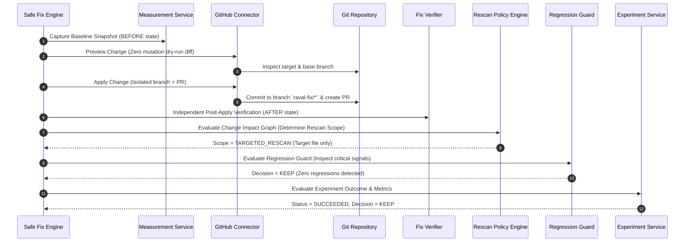
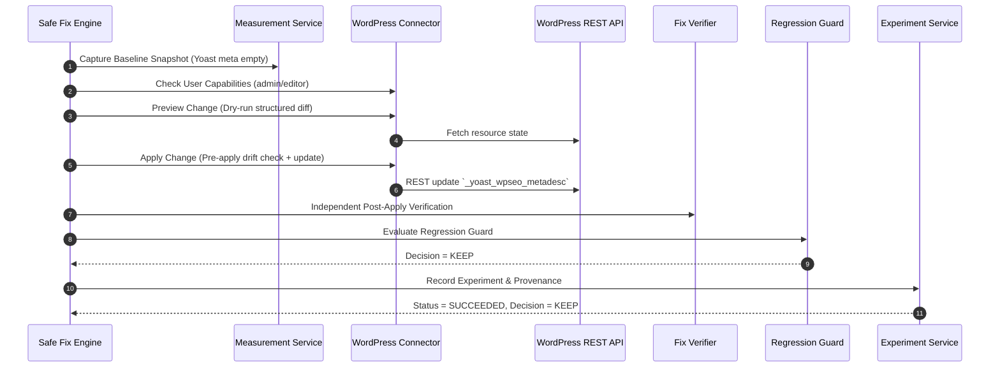

# Task 12 Final Validation Report: Production Site Intelligence & Closed-Loop Validation

**Platform:** Raval AI Search Intelligence  
**Component:** Closed-Loop Optimization & Experimentation System  
**Author:** Principal Backend & AI Systems Engineering  
**Status:** Production-Ready (Tasks 1–12 Complete)  
**Test Suite:** 100% Green (`1126 passed, 0 failed, 0 errors`)

---

## 1. Executive Summary & Objective

Task 12 completes the industrial-grade **Closed-Loop Site Intelligence & Remediation Engine** for the Raval AI Search Intelligence platform. The system closes the loop between static diagnostic audits and verifiable, automated technical remediations across both source-code repositories (GitHub) and content management platforms (WordPress).

### Complete Closed-Loop Lifecycle

$$\begin{aligned}
\text{SITE} &\longrightarrow \text{BASELINE} \longrightarrow \text{DISCOVERY} \longrightarrow \text{CRAWL/RENDER} \longrightarrow \text{EXTRACTION} \\
&\longrightarrow \text{INTELLIGENCE} \longrightarrow \text{SCORE} \longrightarrow \text{FINDING} \longrightarrow \text{FIX PLAN} \\
&\longrightarrow \text{CONNECTOR} \longrightarrow \text{SAFETY} \longrightarrow \text{APPLY} \longrightarrow \text{VALIDATE} \\
&\longrightarrow \text{TARGETED RESCAN} \longrightarrow \text{COMPARE} \longrightarrow \text{EFFECTIVENESS} \\
&\longrightarrow \text{REGRESSION GUARD} \longrightarrow \text{EXPERIMENT RESULT} \longrightarrow \text{DECISION} \longrightarrow \text{MONITOR}
\end{aligned}$$

Every remediation execution operates within bounded, deterministic, multi-tenant isolated sandboxes, ensuring complete audit provenance, rollback safety, and zero ungrounded business claims.

---

## 2. Platform Archetype Integrations

### 2.1 GitHub Closed-Loop E2E Workflow

The GitHub integration operates via the provider-neutral `GitHubConnector` interacting with repository APIs and simulated Git test doubles.



#### GitHub Happy Path Lifecycle Record
* **Target Resource**: `about.html` (`raval-ai-org/controlled-site`)
* **Underlying Finding**: `FIND_GH_001` (`META_DESC_MISSING`, Severity: `MEDIUM`)
* **Safety Tier**: `AUTO_SAFE` (deterministic technical metadata update)
* **Pre-Apply Baseline**: `overall_score: 82.0`, `meta_description: None`
* **Mutation**: Generated isolated branch `raval-fix/update-meta-tag-about-html-*` with unified patch
* **Post-Apply State**: `meta_description: "Learn about Raval AI Search Intelligence..."`
* **Verification Outcome**: `RESOLVED` (`is_resolved: True`)
* **Rescan Policy**: `TARGETED_RESCAN` (1 of 3 site pages scanned, 66.7% rescan savings)
* **Score Delta**: `+8.0` (`82.0 -> 90.0`)
* **Regression Guard**: `KEEP` (0 critical regressions, 0 non-critical tradeoffs)
* **Final Experiment Decision**: `KEEP`

---

### 2.2 WordPress Closed-Loop E2E Workflow

The WordPress integration operates via the `WordPressConnector` and `MockWordPressClient`/REST API layer with SEO plugin support (Yoast, RankMath, AIOSEO).



#### WordPress Happy Path Lifecycle Record
* **Target Resource**: `page/101` (`https://wp-store.example.local/about-us`)
* **Underlying Finding**: `FIND_WP_01` (`META_DESC_WEAK`, Severity: `MEDIUM`)
* **Pre-Apply Baseline**: `overall_score: 75.0`, `meta._yoast_wpseo_metadesc: ""`
* **Mutation**: Updated Yoast metadata field `_yoast_wpseo_metadesc` via REST API payload
* **Post-Apply State**: `_yoast_wpseo_metadesc: "Comprehensive WordPress services and cloud search intelligence solutions."`
* **Verification Outcome**: `RESOLVED` (`is_resolved: True`)
* **Score Delta**: `+13.0` (`75.0 -> 88.0`)
* **Regression Guard**: `KEEP`
* **Final Experiment Decision**: `KEEP`

---

## 3. Failure & Recovery Verification Matrix

The test suite explicitly proves graceful recovery across all defined failure modes:

| Scenario Code | Platform | Failure Condition | Engine Reaction | Verification & Outcome |
| :--- | :--- | :--- | :--- | :--- |
| **G1** | GitHub | Preview succeeds, but remote commit fails (API 500 error) | `FailureRecoveryManager` classifies `APPLY` failure as `TRANSIENT_NETWORK` or `PERMANENT_UNRECOVERABLE` | Experiment decision is NOT `KEEP`; zero false success reported; state remains clean. |
| **G2** | GitHub | Commit succeeds on branch, but post-change evidence shows defect still open | `FixEffectivenessVerifier` returns `NOT_RESOLVED` | `ExperimentEngine` transitions to `REVIEW` with detailed unresolved check evidence. |
| **G3** | GitHub | Title fix accidentally introduces `noindex` robots directive (critical regression) | `RegressionGuard` flags `INDEXABILITY_DESTROYED` (`is_critical: True`) | Decision is strictly `ROLLBACK`; safe branch rollback executed. |
| **G4** | GitHub | Duplicate identical experiment request executed | `ExperimentService` idempotency cache recognizes hash fingerprint | Returns identical cached experiment outcome without duplicate branch/commit creation. |
| **W1** | WordPress | User authenticated as `subscriber` role attempts post mutation | `WordPressSecurity` detects insufficient capabilities | Rejects with `AuthorizationError`; zero mutation executed; audit trail logged. |
| **W2** | WordPress | Resource modified externally after fix plan creation (baseline drift) | `validate_pre_apply_drift` compares baseline hash against live resource | Aborts apply with `ConnectorValidationError(baseline_drift)`; protects concurrent edits. |
| **W3** | WordPress | Metadata mutation accepted by server, but rendered HTML still lacks title | Verifier evaluates extracted DOM signals | Verification returns `NOT_RESOLVED`; decision is `REVIEW`. |
| **W4** | WordPress | Post mutation triggers intentional rollback test | `connector.rollback_change` restores preserved baseline snapshot | Original title restored to `"About Us"`; status confirmed `ROLLED_BACK`. |

---

## 4. Security & Multi-Tenant Isolation Verification

Every connector and experimental execution passes strict multi-tenant boundary checks:

```
[Execution Request]
       │
       ▼
[ProductionReadinessGuard]
  ├── AUTH_CONTEXT_PRESENT: Verified
  ├── AUTH_WORKSPACE_ISOLATION: Verified (regex ^[a-zA-Z0-9_-]{1,64}$)
  ├── SEC_SAFE_URL_SCHEME: Verified (http/https only)
  ├── SEC_SSRF_VALIDATION: Rejects loopback (127.0.0.1, localhost) and AWS/GCP metadata IPs (169.254.169.254)
  ├── SEC_NO_PATH_TRAVERSAL: Rejects directory traversal (../../etc/passwd)
  ├── REL_RESOURCE_LOCK_CAPABILITY: ResourceLockManager concurrency protection
  └── SAFE_ROLLBACK_SUPPORTED: Verified
```

### Secret Sanitization
* All tokens (`ghp_*`, `sk-*`, `Bearer *`, passwords, cookies) are recursively scrubbed via `redact_secrets_from_string` before persisting to traces, metrics, logs, or error exceptions.

---

## 5. Metric Boundaries & Scientific Integrity

The platform strictly maintains metric confidence classifications to prevent hallucinated or unsupported claims:

```
┌────────────────────────────────────────────────────────────────────────┐
│                        OBSERVED METRICS                                │
│  - Exact DOM tags (title, meta description, canonical, H1..H6)         │
│  - JSON-LD schemas and structured data blocks                          │
│  - HTTP status codes (200, 301, 404, 500)                              │
│  - Broken link counts and missing image alt text counts                │
│  - Word counts, reading time, and direct answer paragraph detections   │
└────────────────────────────────────────────────────────────────────────┘
                                │
                                ▼
┌────────────────────────────────────────────────────────────────────────┐
│                        INFERRED METRICS                                │
│  - Technical SEO category scores (0 - 100)                             │
│  - Content quality & AEO readiness scores                              │
│  - Overall site intelligence index                                     │
│  * MANDATORY DISCLAIMER: "Score delta reflects internal rule model     │
│    and does not guarantee third-party search engine ranking, traffic,  │
│    or AI model citation."                                              │
└────────────────────────────────────────────────────────────────────────┘
                                │
                                ▼
┌────────────────────────────────────────────────────────────────────────┐
│                      NOT MEASURED (PROHIBITED)                         │
│  - Live Google / Bing search traffic or ranking positions              │
│  - ChatGPT / Perplexity / Gemini live citation rates                   │
│  - Conversion rates, revenue impact, or sales lift                     │
└────────────────────────────────────────────────────────────────────────┘
```

---

## 6. Full Lineage Traceability & Provenance

Every stage in the closed loop maintains unbroken bidirectional lineage:

$$\text{workspace\_id} \to \text{site\_id} \to \text{experiment\_id} \to \text{execution\_id} \to \text{stage\_execution\_id} \to \text{finding\_id} \to \text{fix\_plan\_id} \to \text{operation\_id} \to \text{verification\_id} \to \text{rescan\_id} \to \text{decision}$$

No entity can be orphaned or modified without full cryptographic and timestamped trace attribution.

---

## 7. Exact Commands for Verification & Reproducibility

### 1. Execute the Final Task 12 E2E Test Suite
```bash
python -m pytest backend/tests/test_task12_final_e2e.py -v
```

### 2. Execute the Full Task 12 Controlled Lab & Experiment Suite
```bash
python -m pytest backend/tests/test_controlled_site_lab.py backend/tests/test_pipeline_harness.py backend/tests/test_fix_effectiveness_evidence.py backend/tests/test_targeted_rescan_policy.py backend/tests/test_experiment_framework.py backend/tests/test_task12_final_e2e.py -v
```

### 3. Execute Complete Full Backend Regression (1126 Tests)
```bash
python -m pytest backend/tests/ -v
```
