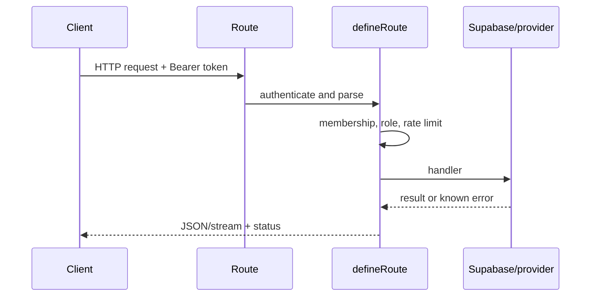

# API reference

The route files under `src/app/api` are the contract source. Request bodies and
queries are validated with Zod where the route uses `defineRoute`; inspect the
linked handler before adding a client. Authenticated requests use a Supabase
bearer token. Workspace routes require a verified `workspaceId` and may require
`owner`, `admin`, or `editor`.

## Current API model

The API layer in Mellox AI is the product boundary between browser orchestration
and server-side trust enforcement. It is responsible for parsing requests,
checking workspace membership, verifying role, evaluating budgets, contracting
provider calls, and returning normalized result payloads. The browser should not
be treated as the authority for any high-impact operation.

## Route ownership conventions

Every route or function should be owned by the domain it serves. In practice that
means:

- chat and brand work go through AI route handlers and server AI services;
- workspace operations go through the workspace server/service layer;
- social and distribution flows go through distribution adapters;
- GEO and agent tasks go through the server-side scan, approval, and fix flows;
- analytics and connector flows use server-only OAuth and sync routines.

If a new API surface is added, it should follow the same pattern: validate input,
check workspace authorization, enforce limits, and then call the domain service.
This keeps the app predictable and avoids the repo turning into a collection of
one-off browser-controlled side effects.

## Contract expectations

Route contracts are intentionally narrow and explicit. The app expects:

- stable JSON payloads for normal success and failure,
- mapped error codes rather than raw provider blobs,
- workspace-scoped IDs and role validation for protected actions,
- no secret material in responses, and
- idempotent retries for actions that create or mutate records.

When a route or function changes, update the matching feature guide and any test
that validates the contract. The code is the source of truth for the exact
payloads.

## Request lifecycle and response rules



Typical errors: `400` invalid input or blocked URL, `401` missing/invalid auth,
`403` insufficient workspace role, `429` rate/budget limit, upstream mapped
status, and generic `500` for unknown failures. JSON errors intentionally avoid
provider secrets and internal stack traces.

## Route index

| Area | Routes |
| --- | --- |
| Core AI | `/api/chat`, `/api/clarify`, `/api/ai-generate`, `/api/brand-extract`, `/api/file-extract`, `/api/memory-extract` |
| Market | `/api/market/intelligence`, `/api/market/latest`, `/api/market/trends` |
| GEO | `/api/geo/scans`, `/api/geo/scans/:id`, `/api/geo/scans/:id/cancel` |
| Agents | `/api/agents/actions`, `/api/agents/findings`, `/api/agents/run`, `/api/agents/runs`, `/api/agents/settings`, `/api/agent-tasks` |
| Studio/media | `/api/studio/ideas`, `/api/studio/jobs`, `/api/studio/jobs/:id`, `/api/studio/jobs/:id/cancel`, `/api/studio/prompt`, `/api/generate-image`, `/api/generate-video`, `/api/pexels/video`, `/api/unsplash/random` |
| UGC | `/api/ugc/models`, `/api/ugc/products/extract`, `/api/ugc/projects`, `/api/ugc/projects/:id`, `/api/ugc/projects/:id/concepts`, `/api/ugc/projects/:id/notes`, `/api/ugc/references/import`, `/api/ugc/references/upload`, `/api/ugc/renders`, `/api/ugc/renders/:id`, `/api/ugc/renders/:id/cancel`, `/api/ugc/renders/:id/download`, `/api/ugc/renders/:id/post-draft` |
| Distribution | `/api/sdr/accounts`, `/api/sdr/cancel`, `/api/sdr/disconnect`, `/api/sdr/oauth/start`, `/api/sdr/publications`, `/api/sdr/publish`, `/api/sdr/schedule`, `/api/sdr/status`, `/api/social-multi`, `/api/social/analytics`, `/api/social/connect/*`, `/api/social/creator-info`, `/api/social/metrics/sync`, `/api/social/retry` |
| Assets/shares | `/api/assets/library`, `/api/assets/persist`, `/api/shares`, `/api/public/share/:slug` |
| Platform integrations | `/api/integrations/github/callback`, `/api/integrations/github/webhook`, `/api/integrations/google/callback` |
| Operations | `/api/health`, `/api/health/ready`, `/api/usage`, `/api/client-errors` |
| Public hooks | `/api/public/hooks/agents-tick`, `analytics-sync`, `competitor-watch`, `geo-agents`, `geo-scans`, `kie`, `ops-watch`, `run-schedules`, `sdr`, `sdr-reconcile`, `socialapi`, `ugc-renders` |
| Server functions | `/api/rpc/[...fn]` |

## Examples

Workspace usage:

```http
GET /api/usage?workspaceId=00000000-0000-0000-0000-000000000000
Authorization: Bearer <supabase-access-token>
```

The response contains `plan`, `status`, `notice`, `spend`, `quotas`, `cache`, and
recent usage records. Values are computed server-side from budget and usage
services.

Chat:

```http
POST /api/chat
Authorization: Bearer <supabase-access-token>
Content-Type: application/json

{"workspaceId":"00000000-0000-0000-0000-000000000000","messages":[{"role":"user","content":"Draft a launch angle."}],"modelId":"default"}
```

The server removes client system turns, anchors identity to the verified
workspace, and returns the gateway's streaming response. The accepted model ids
come from `CHAT_MODEL_CHOICES`; clients must not send arbitrary provider model
names.

Publishing:

```http
POST /api/sdr/publish
Authorization: Bearer <supabase-access-token>
Content-Type: application/json

{"workspaceId":"00000000-0000-0000-0000-000000000000","contentItemIds":["..."],"selection":{"type":"all"}}
```

Publishing requires editor role, approved content, workspace-owned targets, an
enabled distribution provider, and available plan credits. Exact validation and
provider response mapping are in `src/app/api/sdr/publish/route.ts` and its
handlers. Never document real ids, tokens, signatures, or provider payloads.
