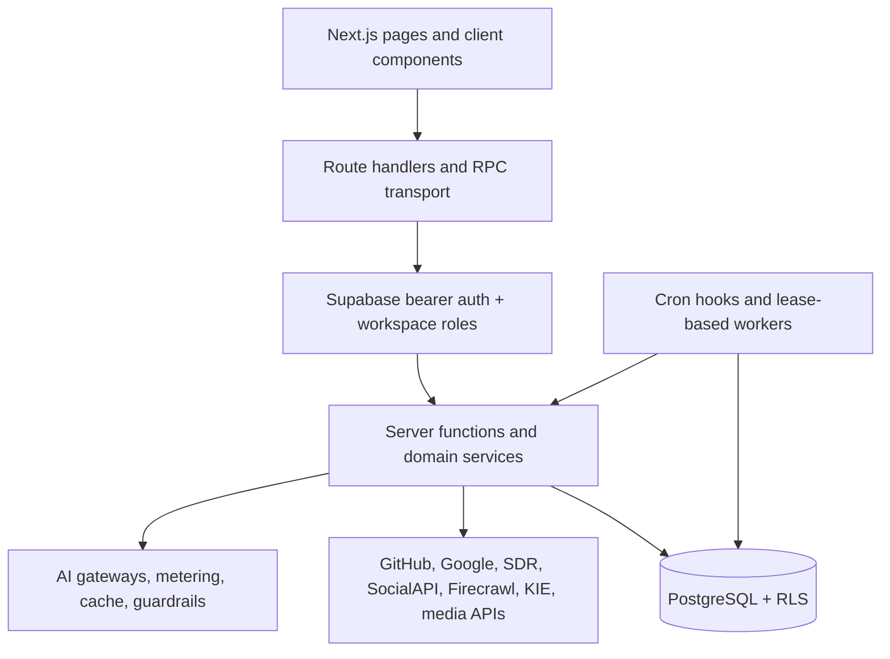

# Architecture overview

Mellox AI is a workspace-scoped Next.js application. The browser renders product
surfaces and invokes authenticated HTTP routes or server-function stubs. The
server validates identity and input, verifies workspace access, applies rate
and budget controls, calls integrations through server-only adapters, and
persists state in Supabase.

The most important invariant is workspace identity: it comes from a verified
route/context value, not from a browser-selected fallback or an untrusted
stored “last workspace” value. See [workspaces and Brand DNA](workspaces-and-brand-dna.md).

The codebase also includes external services and deployment artifacts. The
repository does not prove a single universal production topology; use
[deployment guide](deployment-guide.md) for verified artifacts and TODOs.

## Current implementation boundaries

The current implementation separates concerns in a way that is important for
contributors:

- `src/` contains the main application, pages, route handlers, and browser UI
- `src/server/` owns authorization, persistence patterns, provider adapters, and
  background work coordination
- `src/lib/` holds shared application logic, prompts, contracts, and pure
  computing modules that are used by the app and server
- `supabase/` is the database source of truth for schema, policies, and
  migration state
- `backend/`, `crawler/`, `analytics/`, `content-engine/`, and similar folders
  hold supporting Python intelligence and automation packages
- `Social-Distribtion-Engine-RavalAI-SDE/` contains the separate distribution
  runtime used for social publishing and delivery operations

This separation reflects the real architecture of the product: the web app is a
control plane and orchestration layer, while external services and specialized
Python modules handle execution-heavy work and integrations.
