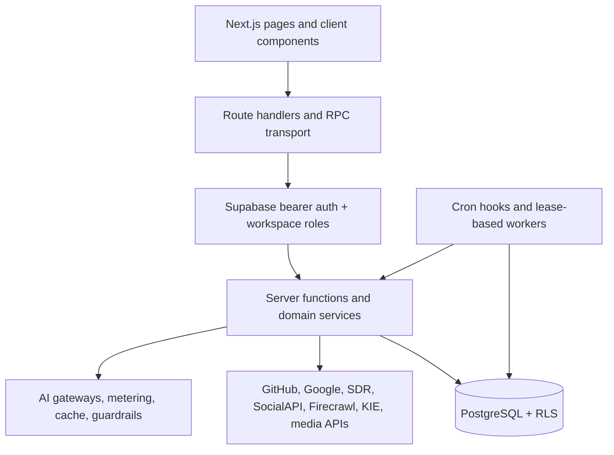

# Architecture overview

Mellox AI is a workspace-scoped Next.js application. The browser renders product
surfaces and invokes authenticated HTTP routes or server-function stubs. The
server validates identity and input, verifies workspace access, applies rate
and budget controls, calls integrations through server-only adapters, and
persists state in Supabase.

The most important invariant is workspace identity: it comes from a verified
route/context value, not from a browser-selected fallback or an untrusted
stored “last workspace” value. See [workspaces and Brand DNA](workspaces-and-brand-dna.md).

The codebase also includes external services and deployment artifacts. The
repository does not prove a single universal production topology; use
[deployment guide](deployment-guide.md) for verified artifacts and TODOs.
