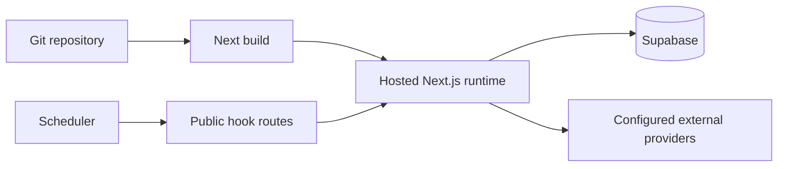

# Deployment guide

## Build and runtime

The application uses Next.js standalone/build artifacts and can be deployed
through the repository's Amplify, Docker, and deployment scripts. The app's
normal local port is 8080. Supabase migrations are applied separately from the
web build.

The deployment model for Mellox AI is a product runtime plus integration layer:
Next.js serves the product experience while migrations, provider credentials,
public hooks, and server-only services enforce the actual business logic.
Production deployment is therefore not only a frontend build step; it includes
checks for auth state, database schema, provider connectivity, and runtime
jobs.

## Release checks

Run `npm run typecheck`, `npm run lint`, `npm test`, and `npm run build`.
Validate migrations with `npm run db:verify`, then apply them to the target
Supabase environment using the approved operational procedure. Exercise real
provider/database paths with `npm run test:live` where credentials and consent
exist. Verify health, readiness, callbacks, cron authentication, and a
workspace-scoped smoke flow.

## Environment separation

Development, test, and production must use separate Supabase projects and
provider credentials. Do not point production `APP_URL` at localhost. Feature
flags should be enabled deliberately and verified through health/configuration
checks.

TODO: the repository contains multiple deployment artifacts and historical ADRs;
confirm the single production owner, hosting target, rollback command, and
migration approval gate with the operations owner before publishing a definitive
provider-specific runbook.
